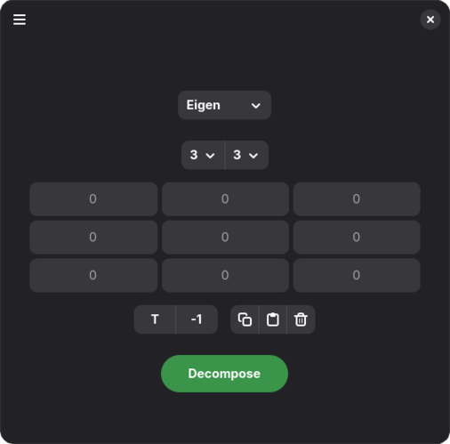

  
  

  <h1>Eigen</h1>
  <b>Nice and simple matrix calculator</b>

 

  

 
Eigen is a GTK4 matrix calculator, designed with ease of use and elegance in mind.

It supports:

✅ Main matrix-matrix and matrix-scalar operations

✅ Transposition and matrix inversion

✅ Eigendecomposition, as well as other decompositions, such as QR, LU

⚙️ Eigen uses NumPy matrix format, and makes working with them quite easy!

⚠️ Eigen is a very young app, so you're welcome to report the issues!

## Installation

## Dependencies

- gtk4
- libadwaita1

